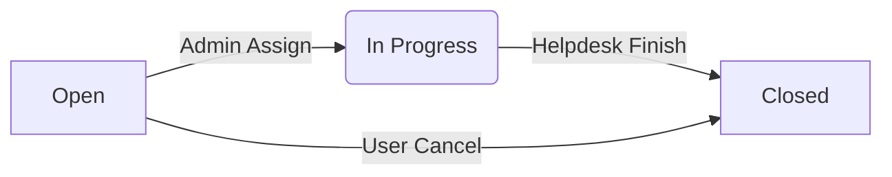

# Alur Kerja Sistem (System Flow) - E-Ticketing Helpdesk

Dokumen ini menjelaskan alur bisnis dan teknis aplikasi E-Ticketing Helpdesk, mulai dari pendaftaran pengguna hingga penyelesaian keluhan.

---

## 👥 1. Peran Pengguna (User Roles)

1.  **Pengguna (User/Client)**: Karyawan atau pelanggan yang mengalami kendala teknis.
2.  **Admin**: Manajer sistem yang memantau seluruh tiket dan menugaskan pekerjaan.
3.  **Helpdesk (Staff)**: Teknisi yang bertugas menyelesaikan kendala yang ditugaskan.

---

## 🔄 2. Alur Bisnis Utama (Core Business Flow)

### **A. Tahap Registrasi & Autentikasi**
1.  **Registrasi**: User baru mendaftar melalui `RegisterScreen`. Data disimpan ke tabel `users` dengan default `role_id: 3` (User).
2.  **Login**: User masuk melalui `LoginScreen`. Sistem mencocokkan kredensial dan menyimpan data profil ke dalam `Session`.

### **B. Tahap Pelaporan (User Flow)**
1.  **Buat Tiket**: User mengisi form di `CreateTicketScreen` (Judul, Kategori, Prioritas, Deskripsi, & Lampiran Foto).
2.  **Submit**: Tiket disimpan ke database dengan status awal **"OPEN"**.
3.  **Log Riwayat**: Sistem secara otomatis mencatat log pertama: *"Tiket berhasil dibuat"*.

### **C. Tahap Penugasan (Admin Flow)**
1.  **Monitoring**: Admin melihat daftar tiket baru di Dashboard.
2.  **Assign**: Admin memilih tiket berstatus "OPEN" dan menugaskannya ke staf Helpdesk tertentu.
3.  **Update Status**: Status tiket otomatis berubah menjadi **"IN PROGRESS"**.
4.  **Notifikasi**: Staf Helpdesk menerima notifikasi bahwa ada tiket baru yang harus ditangani.

### **D. Tahap Penanganan (Helpdesk Flow)**
1.  **Diskusi**: Helpdesk dan User dapat saling membalas komentar di `TicketDetailScreen` untuk detail kendala.
2.  **Pengerjaan**: Helpdesk melakukan perbaikan fisik/sistem sesuai deskripsi.
3.  **Tracking**: Setiap progres dicatat dalam riwayat perjalanan tiket (Log History).

### **E. Tahap Penyelesaian (Closing Flow)**
1.  **Finish**: Setelah pekerjaan selesai, Helpdesk menekan tombol "Selesaikan & Tutup Tiket".
2.  **Final Status**: Status tiket berubah menjadi **"CLOSED"**.
3.  **Selesai**: Tiket dikunci dan tidak dapat diubah lagi, namun riwayat tetap dapat dilihat sebagai arsip.

---

## 🛠️ 3. Alur Teknis (Technical Architecture)

### **Data Flow**
1.  **Frontend (Flutter)**: Mengambil input pengguna dan mengelola state UI (Dark/Light mode).
2.  **API Service**: Mengirimkan permintaan HTTP (REST) ke backend menggunakan `http` package.
3.  **Backend (Supabase)**: 
    *   **PostgREST**: Menangani query database secara otomatis.
    *   **Storage**: Menyimpan lampiran foto dalam bentuk Base64 (atau bucket jika diupgrade).
    *   **Database**: PostgreSQL menyimpan tabel `users`, `tickets`, `ticket_histories`, dan `ticket_comments`.

### **State Management**
*   **Theme Mode**: Dikelola oleh `ValueNotifier` untuk perubahan instan tanpa restart.
*   **User Session**: Disimpan dalam Singleton class `Session` selama aplikasi berjalan.

---

## 📊 4. Diagram Status Tiket (State Machine)

---

## 🔔 5. Mekanisme Notifikasi
Sistem notifikasi bekerja berdasarkan `target_role_id` atau `target_user_id`:
*   **Tiket Baru**: Mengirim notifikasi ke **Admin** (Role 1).
*   **Tiket Ditugaskan**: Mengirim notifikasi ke **Helpdesk** tertentu (Role 2).
*   **Status Update/Komentar**: Mengirim notifikasi balik ke **User Pembuat** (Role 3).
